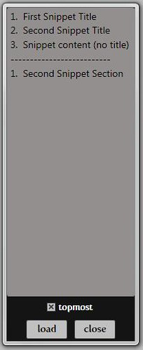

***FEATURES***

• To use a snippet:  Drag the title of the snippet to the desired target app.

• In order to move the app around: Drag the black bottom portion of the window.

• The topmost checkbox and load/close buttons will work as expected.

Link to complete article [http://scorbs.com/2008/03/18/snippetmanager/comment-page-1/#comment-3479](http://scorbs.com/2008/03/18/snippetmanager/comment-page-1/#comment-3479)
