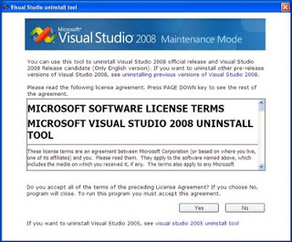
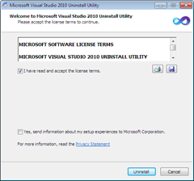

If you’ve any problems in **uninstalling Visual Studio 2008, 2010** from Add/ Remove programs in XP or from Programs and features in Windows  7 you can use **Microsoft Visual Studio 2008 Auto uninstall utility** to remove Visual Studio 2008 and **Visual Studio 2010 Auto uninstall utility** to remove Visual Studio 2010 editions from your Computer .

# 1\. Microsoft Visual Studio 2008 Auto Uninstall Tool

**[Download here](http://blogs.msdn.com/cfs-file.ashx/__key/communityserver-components-postattachments/00-09-90-82-99/UninstallTool.exe)**

**2\. Microsoft Visual Studio 2010 Auto Uninstall Tool**

**[Download here](http://archive.msdn.microsoft.com/vs2010uninstall/Release/ProjectReleases.aspx?ReleaseId=4321)**
