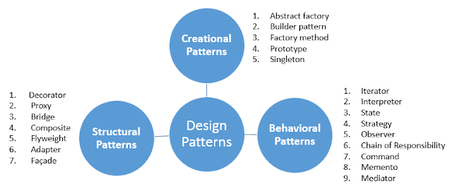

# Design Patterns and there advantages

## What are Design Patterns:

Design patterns are solutions/patterns to problems which occurs in many situations.  
  

## Advantages of Design Patterns:

1. Developers can select a tried and well tested solutions
2. Makes development and maintenance of code easy and fast
3. Design patterns are language independent hence we use them in any language which supports object oriented
4. Highly flexible and can be used in any application/domain
5. Using design patterns we can create reusable object oriented designs

  

## Types of Design Patterns

Design Patterns are broadly classified into three  Types based on their purpose.  

1. Creational design patterns
2. Structural design patterns
3. Behavioral design patterns 

These three patterns are further divided into 23 design patters refer to below illustration.  

