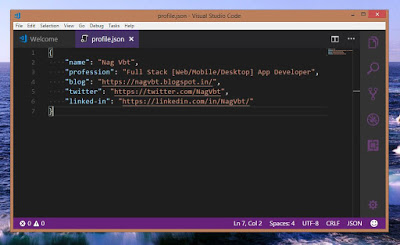

# Visual Studio Code Theme customization
<!--markdownlint-disable MD013 MD029 MD036 MD024 MD033 MD040 MD042 MD001 MD051 MD025 MD052 MD045-->

My favorite source code editor is Visual Studio Code. Every day I use it for my web application, PWA ( progressive web application) and Ionic Mobile apps development. It is a light weight open source code editor developed by Tech giant Microsoft.



We can customize the look and feel of the editor according to our taste and comfort. In this small blog post I will show how modify the workbench.
<!-- truncate -->
1. Open Visual Studio Code  
2. Select File->Prefernces->Settings and add the below json

```json
{
  "typescript.tsdk": "node_modules/typescript/lib",
  "terminal.integrated.shell.windows": "C:\\windows\\Sysnative\\cmd.exe",

  // Search exclude
  "search.exclude": {
    "**/.git": true,
    "**/.svn": true,
    "**/.hg": true,
    "**/CVS": true,
    "**/.DS_Store": true,
    "**/platforms": true,
    "**/bld": true,
    "**/bin": true,
    "**/Windows-x64": true
  },

  // Files to exlude
  "files.exclude": {
    "**/.git": true,
    "**/.svn": true,
    "**/.hg": true,
    "**/CVS": true,
    "**/.DS_Store": true,
    "**/bld": true,
    "**/bin/": true,
    "**/Windows-x64": true
  },

  // Editor Settings
  "editor.fontWeight": "200",  
  "editor.fontSize": 14,
  "editor.fontFamily": "Consolas, 'Courier New', monospace",
  "editor.letterSpacing": 0.3,
  "editor.lineHeight": 0,
  "editor.minimap.enabled": true,
  "editor.formatOnType": true,
  "editor.formatOnPaste": true,
  "editor.wordWrap": "on",
  "editor.minimap.renderCharacters": false,
  "editor.renderWhitespace": "boundary",  
  "editor.mouseWheelZoom": true,
  "editor.renderIndentGuides": false,
  "editor.accessibilitySupport": "off",
  "editor.formatOnSave": true,
  "editor.rulers": [
    80,
    100
  ],

  // git related
  "git.countBadge": "all",
  "git.checkoutType": "remote",

  // files related
  "files.autoSave": "afterDelay",
  "files.autoSaveDelay": 1000,

  // zen mode
  "zenMode.fullScreen": true,
  "zenMode.hideTabs": false,
  "zenMode.hideStatusBar": false,
  
  // workbench related
  "workbench.activityBar.visible": true,
  "workbench.sideBar.location": "right",
  "workbench.iconTheme": "vscode-icon-theme",
  "workbench.colorTheme": "Visual Studio Dark",
  "workbench.colorCustomizations": {
    "activityBar.foreground": "#8C489F",
    "activityBarBadge.background": "#C3C3E5",
    "activityBarBadge.foreground": "#443266",
    "tab.activeBackground": "#443266",
    "statusBar.background": "#433166",
    "button.background": "#8C489F"
  },

  // others
  "window.zoomLevel": 1.5,
  "css.lint.duplicateProperties": "warning",
  // Controls the location of the sidebar. It can either show on the left or right of the workbench.
  "typescript.referencesCodeLens.enabled": true,
}
```
