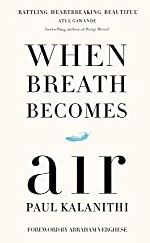

# When Breath Becomes Air

Today I had completed a book [When Breath Becomes Air](https://amzn.to/3yt4tjr) by Paul Kalanithi a Neurosurgeon. Book covers What makes life worth living in the face of death? What do you do when life is catastrophically interrupted? What does it mean to have a child as your own life fades away?

To Buy this book in Amazon: [https://amzn.to/3yxxt9R](https://amzn.to/3yxxt9R)