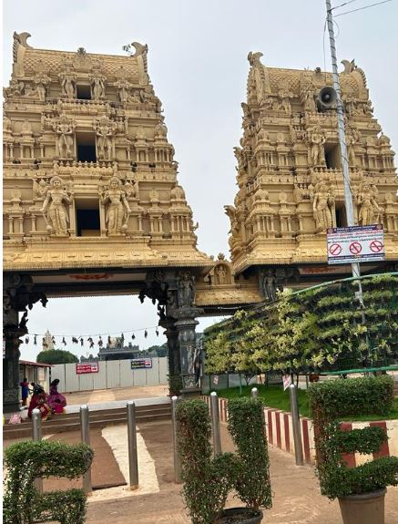
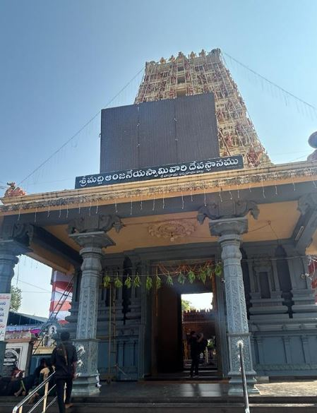

# Trip to Sri Maddi Anjaneya Temple by Walk

| Dwaraka Tirumala | Maddi Anjeneya - Gurvaigudem|
|---|--|
|  |  |

Taken 3 Days for reaching temple and have darshan i.e from 10-11-2023 to 12-11-2023 by walk.
It was a nice experience my iPhone Fitness app shows I had walked for entrie trip with 1st day
as 50.55 km, 2nd Day 38.85 km and 3rd Day as 23.34 km Total 113 KM with pradakshanams
and darshan etc.

|Day | Date | Distance walked (KM)|
|---|---| ----------- |
| 1 | 10-Nov | 50.55 |
| 2 | 11-Nov | 38.85 |
| 3 | 12-Nov | 23.34 |
| # | Total | 112.74 |

But the google map shows 83 km

## Route

10-Nov

1. Atapaka to Eluru
2. Eluru to Gundugolanu - Taken rest here

11-Nov

1. Gundugolanu to Dwaraka Tirumala via Bhimadole

2. Dwaraka Tirumala - Back side Temple Shivalayam to Edavali - Taken rest here

12-Nov

1. Edavali to Gurvaigudem - Maddi Anjaneya temple

Lot of greenary with Palm Oil and coconut Farms/Gardens along the way.

## Travel

- Started walking on 10-11-2023 from Atapaka @08.00 A.M.
- Reached Dwaraka Tirumala on 11-11-2023 @02.00 P.M.

- Started from Dwaraka Tirumala Venkateswara Temple to Gurvaigudem, Maddi Anjaneya Temple @05.00 P.M
- Reached Gurvaigudem, Maddi Anjaneya Temple on 12-11-2023 @01.00 P.M.

## Addresses

1. Sri Venkateswara Swamy vari Devasthanam,
Dwaraka Tirumala (China Tirupathi)
Andhra Pradesh: 534426
Google Map coordinates: 16.955440554304612, 81.25677912183981

2. Sri Maddi Anjaneya temple,
Jangareddigudem, Gurvaigudem,
Andhra Pradesh: 534447
Google Map coordinates: 17.088157853456323, 81.27335789574464
