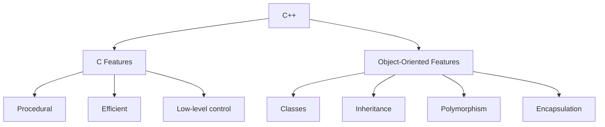

# C++ Basics

C++ is a powerful, general-purpose programming language created as an extension of the C language.
It adds object-oriented features to C, allowing for both procedural and object-oriented programming approaches.



## Key Concepts and Definitions

### 1. Your First C++ Program

Program: A set of instructions that tells the computer what to do.

`#include:` A preprocessor directive that tells the compiler to include a specific file

iostream: A header file that contains functions for input/output operations.

main(): The entry point of a C++ program. Execution always begins here.

std::cout: The standard output stream used to display output.

std::endl: Inserts a newline character and flushes the output buffer.

```cpp
#include <iostream>

int main() {
    std::cout << "Hello, World!" << std::endl;
    return 0;
}
```

**Program Structure Diagram:**

```cpp
┌─────────────────────────────────────────────┐
│ #include <iostream>                         │ ← Preprocessor directive
│                                             │
│ int main() {                                │ ← Main function (entry point)
│     std::cout <<"Hello, World!"<<std::endl; │ ← Output statement
│     return 0;                               │ ← Return statement
│ }                                           │
└─────────────────────────────────────────────┘

```

**Output:**

```text
Hello, World!
```

### 2. Variables and Data Types

Variable: A named storage location in memory that holds a value of a specific type.

Data Type: Defines the kind of data a variable can store and how much memory it occupies.

**Data Types Table:**

```cpp
┌───────────────────────────────────────────────────────┐
│                   C++ Basic Data Types                │
├───────────────┬───────────────────┬───────────────────┤
│ Type          │ Example           │ Memory (typical)  │
├───────────────┼───────────────────┼───────────────────┤
│ int           │ 25, -10, 0        │ 4 bytes           │
│ float         │ 19.99f, -3.5f     │ 4 bytes           │
│ double        │ 3.14159265359     │ 8 bytes           │
│ char          │ 'A', '7', '$'     │ 1 byte            │
│ bool          │ true, false       │ 1 byte            │
│ std::string   │ "John", "Hello"   │ Variable          │
└───────────────┴───────────────────┴───────────────────┘
```

```cpp
#include <iostream>

int main() {
    // Integer types
    int age = 25;                  // Whole number
    
    // Floating-point types
    float price = 19.99f;          // Decimal number (single precision)
    double precise_value = 3.14159265359; // Decimal number (double precision)
    
    // Character type
    char grade = 'A';              // Single character
    
    // Boolean type
    bool is_active = true;         // true or false
    
    // String (from standard library)
    std::string name = "John";     // Text
    
    // Output
    std::cout << "Age: " << age << std::endl;
    std::cout << "Price: $" << price << std::endl;
    std::cout << "Grade: " << grade << std::endl;
    std::cout << "Active: " << is_active << std::endl;
    std::cout << "Name: " << name << std::endl;
    
    return 0;
}
```

**Output:**

```bash
Age: 25
Price: $19.99
Grade: A
Active: 1
Name: John
```

### 3. Input and Output

Input: Data provided to the program, typically from the user.

Output: Data produced by the program, typically displayed to the user.

```cpp
#include <iostream>
#include <string>

int main() {
    std::string name;
    int age;
    
    // Output
    std::cout << "Enter your name: ";
    
    // Input
    std::getline(std::cin, name);
    
    std::cout << "Enter your age: ";
    std::cin >> age;
    
    // Output with variables
    std::cout << "Hello, " << name << "! You are " << age << " years old." << std::endl;
    
    return 0;
}
```

**Input and Output Diagram:**

```cpp
┌──────────────┐      ┌──────────────────┐     ┌──────────────┐
│              │      │                  │     │              │
│    User      │────▶│    C++ Program   │────▶│   Console    │
│              │      │                  │     │              │
└──────────────┘      └──────────────────┘     └──────────────┘
       │                      ▲                       │
       │                      │                       │
       │                      │                       │
       └──────────────────────┴───────────────────────┘
                    Data flow (input/output)

```

**Example Interaction:**

```bash
Enter your name: Alice
Enter your age: 30
Hello, Alice! You are 30 years old.
```

### 4. Operators

Operator: A symbol that tells the compiler to perform specific mathematical or logical operations.

**Operators Table:**

```cpp
┌─────────────────────────────────────────────────────────┐
│                   C++ Operators                         │
├────────────────┬────────────────────┬───────────────────┤
│ Category       │ Operators          │ Example           │
├────────────────┼────────────────────┼───────────────────┤
│ Arithmetic     │ +, -, *, /, %      │ a + b = 13        │
│ Comparison     │ ==, !=, >,<, >=, <=│ a > b = true      │
│ Logical        │ &&, ||, !          │ x && y = false    │
│ Assignment     │ =, +=, -=, *=, /=  │ a += 2 (a = a + 2)│
│ Increment      │ ++, --             │ a++ (a = a + 1)   │
└────────────────┴────────────────────┴───────────────────┘
```

```cpp
#include <iostream>

int main() {
    // Arithmetic operators
    int a = 10, b = 3;
    std::cout << "a + b = " << (a + b) << std::endl;  // Addition
    std::cout << "a - b = " << (a - b) << std::endl;  // Subtraction
    std::cout << "a * b = " << (a * b) << std::endl;  // Multiplication
    std::cout << "a / b = " << (a / b) << std::endl;  // Division (integer)
    std::cout << "a % b = " << (a % b) << std::endl;  // Modulus (remainder)
    
    // Comparison operators
    std::cout << "a == b: " << (a == b) << std::endl; // Equal to
    std::cout << "a != b: " << (a != b) << std::endl; // Not equal to
    std::cout << "a > b: " << (a > b) << std::endl;   // Greater than
    std::cout << "a < b: " << (a < b) << std::endl;   // Less than
    
    // Logical operators
    bool x = true, y = false;
    std::cout << "x && y: " << (x && y) << std::endl; // Logical AND
    std::cout << "x || y: " << (x || y) << std::endl; // Logical OR
    std::cout << "!x: " << (!x) << std::endl;         // Logical NOT
    
    return 0;
}

```

***Output:**

```bash
a + b = 13
a - b = 7
a * b = 30
a / b = 3
a % b = 1
a == b: 0
a != b: 1
a > b: 1
a < b: 0
x && y: 0
x || y: 1
!x: 0
```

## Arrays

Array: A collection of elements of the same type stored in contiguous memory locations.

```cpp

#include <iostream>

int main() {
    // Declare and initialize an array
    int numbers[5] = {10, 20, 30, 40, 50};
    
    // Access array elements
    std::cout << "First element: " << numbers[0] << std::endl;
    std::cout << "Third element: " << numbers[2] << std::endl;
    
    // Modify an element
    numbers[1] = 25;
    std::cout << "Modified second element: " << numbers[1] << std::endl;
    
    // Loop through array
    std::cout << "All elements: ";
    for (int i = 0; i < 5; i++) {
        std::cout << numbers[i] << " ";
    }
    std::cout << std::endl;
    
    return 0;
}
