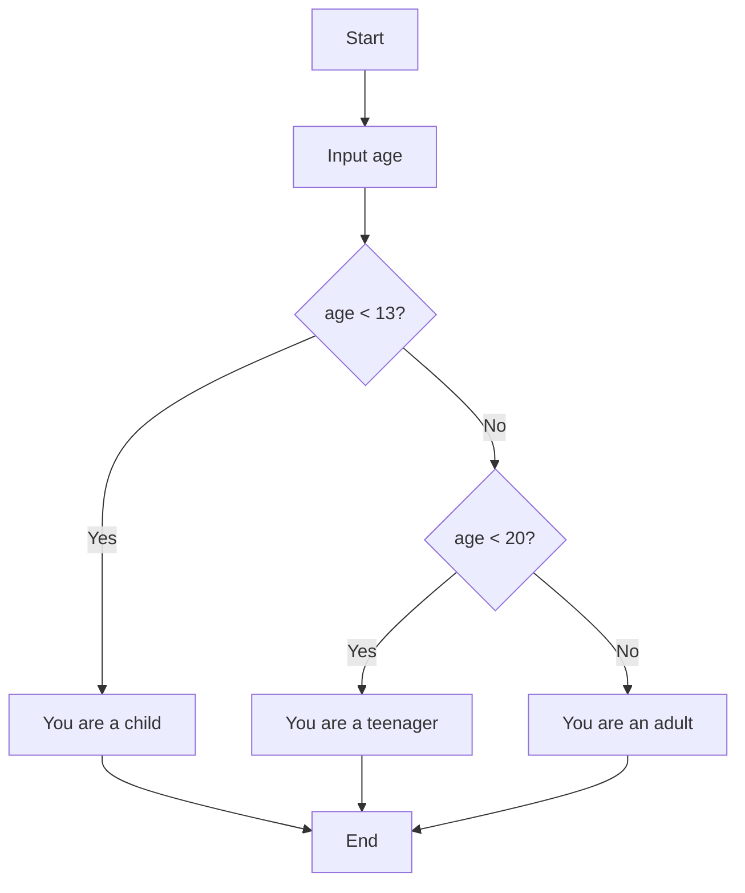
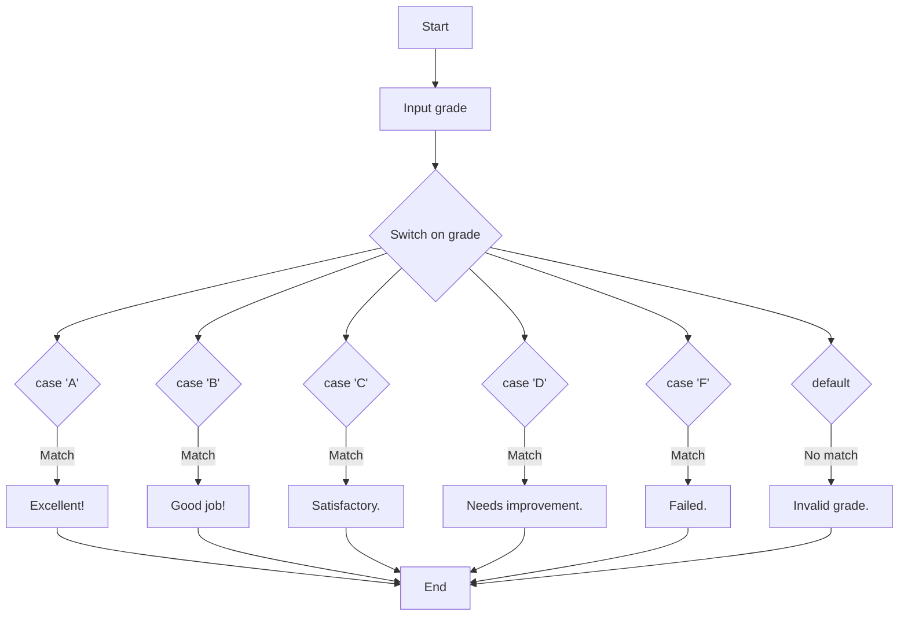

# Conditional Statements

**Conditional Statement:** Code structures that execute different blocks based on whether a condition
is true or false.

1. **if statement:**

2. **else statement:**

3. **else if statement:**
4. **switch statement:**

## If-Else Statement

1. **if statement:** Executes a block of code if a condition is true.
2. **else statement:** Executes when the if condition is false.
3. **else if statement:** Checks additional conditions when previous conditions are false.

```cpp
#include <iostream>

int main() {
    int age;
    
    std::cout << "Enter your age: ";
    std::cin >> age;
    
    if (age < 13) {
        std::cout << "You are a child." << std::endl;
    } else if (age < 20) {
        std::cout << "You are a teenager." << std::endl;
    } else {
        std::cout << "You are an adult." << std::endl;
    }
    
    return 0;
}
```

**If-Else Flow Diagram::**



**Example Output (for age = 15):**

```cpp
Enter your age: 15
You are a teenager.
```

## Switch Statement

**switch statement:** Selects one of many code blocks to execute based on a value.

```cpp
#include <iostream>

int main() {
    char grade;
    
    std::cout << "Enter your grade (A, B, C, D, or F): ";
    std::cin >> grade;
    
    switch (grade) {
        case 'A':
            std::cout << "Excellent!" << std::endl;
            break;
        case 'B':
            std::cout << "Good job!" << std::endl;
            break;
        case 'C':
            std::cout << "Satisfactory." << std::endl;
            break;
        case 'D':
            std::cout << "Needs improvement." << std::endl;
            break;
        case 'F':
            std::cout << "Failed." << std::endl;
            break;
        default:
            std::cout << "Invalid grade." << std::endl;
    }
    
    return 0;
}
```

**Switch Statement Diagram:**



**Example Output (for grade = 'B'):**

```cpp
Enter your grade (A, B, C, D, or F): B
Good job!
```
