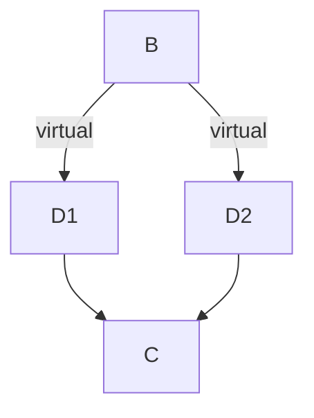
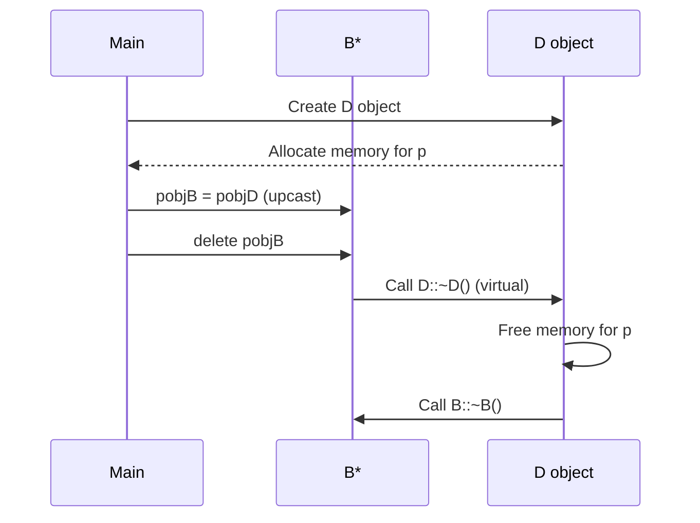
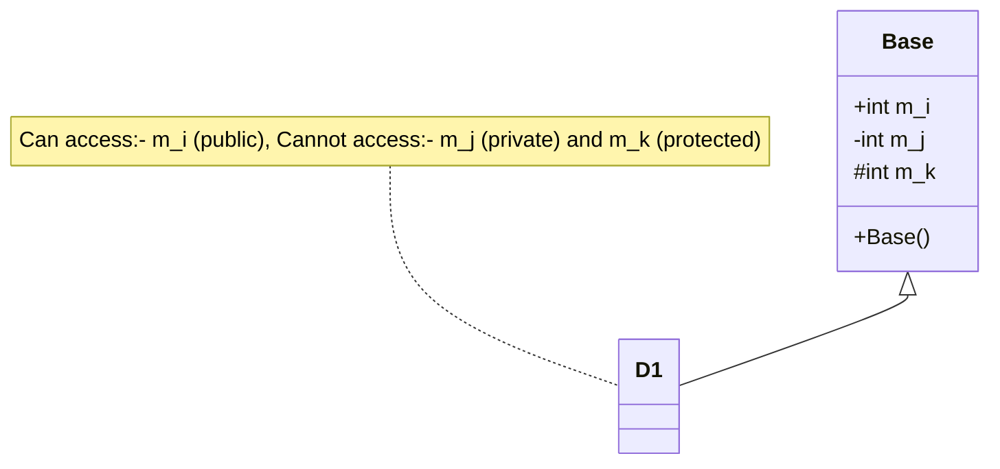
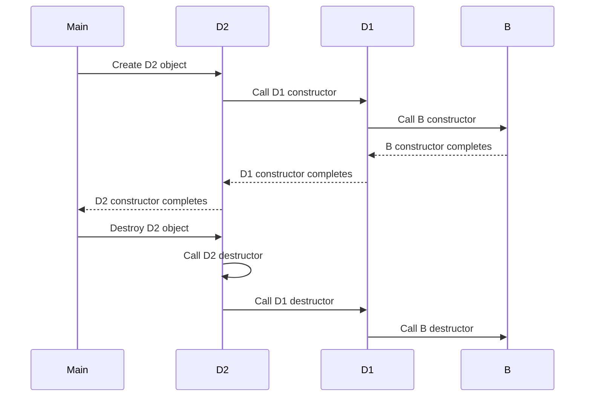
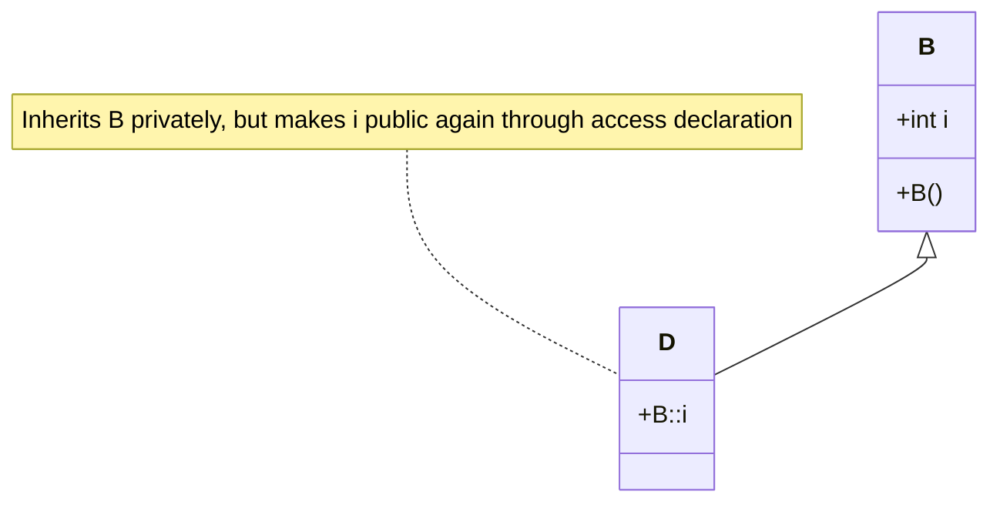
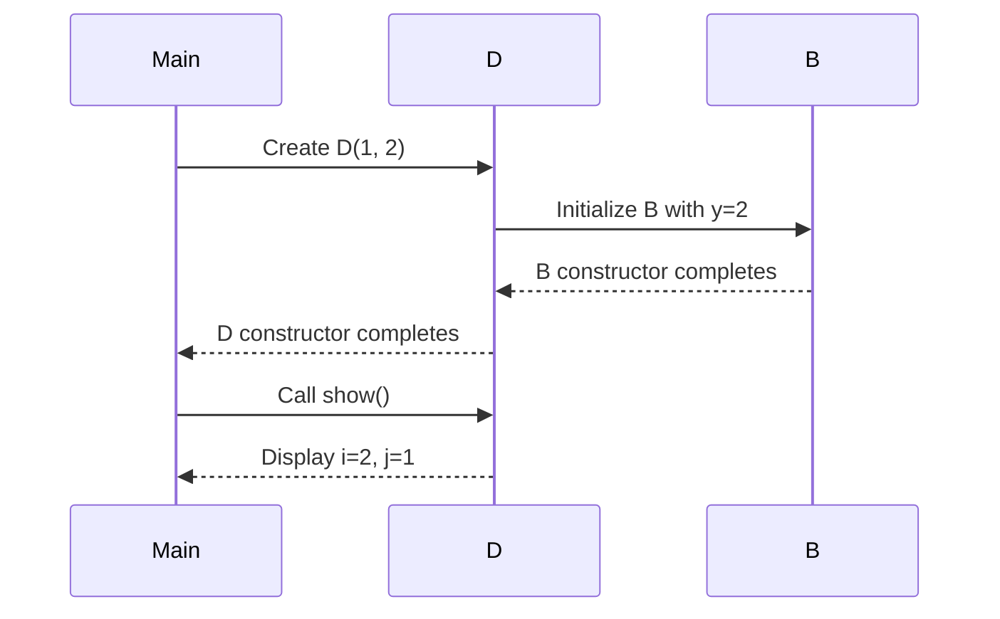

# Inheritance Samples

## 1. Virtual Base Classes / Diamond Problem

Virtual Inheritance: Solves the diamond problem by ensuring a single instance of the base class.

```cpp
class B {
public:
    int i;
    B() { i = 10; }
};

class D1: virtual public B { };
class D2: virtual public B { };
class C: public D1, public D2 { };

void main() {
    C obj;
    cout << obj.i; // Without virtual, this would be ambiguous
}
```

**Diamond Problem Diagram:**



**Explanation:**

- Without virtual inheritance, class C would inherit two copies of B (one through D1 and one through D2)
- This would make obj.i ambiguous - which copy of B's i should it refer to?
- Using virtual inheritance ensures only one copy of B exists in C
- This resolves the ambiguity, allowing direct access to i through C objects

**Output:**
10

## 2. Virtual Destructors

Virtual Destructors: Ensures proper calling order for destructors in class hierarchies.  Essential when deleting derived objects through base class pointers to ensure proper cleanup.

```cpp
class B {
public:
    virtual ~B() { cout << "destructor B" << endl; }
};

class D: public B {
public:
    int *p;
    D() {
        p = new int;
        *p = 10;
    }
    ~D() {
        cout << "destructor D" << endl;
        delete p;
    }
};

void main() {
    int z;
    B *pobjB;
    D *pobjD = new D();
    pobjB = pobjD;
    delete pobjB;
    cin >> z;
}
```
**Virtual Destructor Diagram:**



**Explanation:**

- When a derived class object is deleted through a base class pointer, the base class destructor must be virtual
- Without virtual, only the base class destructor would be called, causing a memory leak (p would not be deleted)
- With virtual, the correct derived class destructor is called first, then the base class destructor
- This ensures proper cleanup of resources allocated by the derived class

**Output:**
```
destructor D
destructor B
```


## 3. Base-class Access Control

Access Control: Public, private, and protected members have different visibility in derived classes.


```cpp
class Base {
public:
    int m_i;
    Base() {
        m_i = 0;
        m_j = 1;
        m_k = 2;
    }
private:
    int m_j;
protected:
    int m_k;
};

class D1: public Base { };

void main() {
    D1 obj;
    cout << obj.m_i;  // Accessible
    //cout << obj.m_j; // Not accessible - private in Base
    //cout << obj.m_k; // Not accessible - protected in Base
}
```

**Access Control Diagram:**



**Explanation:**

- public members (m_i) are accessible from anywhere
- private members (m_j) are only accessible within the Base class
- protected members (m_k) are accessible within Base and derived classes, but not from outside

**Output:**
0

## 4. Constructors and Destructors Execution Order

- Constructors execute from base to derived
- Destructors execute from derived to base

```cpp
class B {
public:
    B() { cout << "constructor B" << endl; }
    ~B() { cout << "Destructor B" << endl; }
};

class D1: public B {
public:
    D1() { cout << "constructor D1" << endl; }
    ~D1() { cout << "Destructor D1" << endl; }
};

class D2: public D1 {
public:
    D2() { cout << "constructor D2" << endl; }
    ~D2() { cout << "Destructor D2" << endl; }
};

void main() {
    D2 obj;
}
```

**Constructor/Destructor Order Diagram:**



**Explanation:**

Constructors are called from base to derived (B → D1 → D2)
Destructors are called in reverse order, from derived to base (D2 → D1 → B)

**Output:**
```
constructor B
constructor D1
constructor D2
Destructor D2
Destructor D1
Destructor B
```

## 5. Granting Access

We can change the access level of inherited members.

```cpp
class B {
public:
    int i; // public in base
    B() { i = 10; }
};

// Inherit base as private
class D: private B {
public:
    // here is access declaration
    B::i; // make i public again
};

void main() {
    D obj;
    cout << obj.i;
    int z;
    cin >> z;
}

```

**Access Declaration Diagram:**



**Explanation:**

- When inheriting privately, all public members of the base class become private in the derived class
- The access declaration B::i; in the public section of D makes i public again
- This allows direct access to i through D objects

**Output:**
10

## 6. Passing Parameters to Base-class Constructors

Use initializer lists to pass parameters to base class constructors.

```cpp
class B {
    int m;
protected:
    int i;
public:
    B(int x) {
        i = x;
        cout << "Constructing base : B\n";
    }
    ~B() {
        cout << "Destructing base : B\n";
    }
};

class D: public B {
    int j;
public:
    // derived uses x; y is passed along to base
    D(int x, int y): B(y) {
        j = x;
        cout << "Constructing derived : D\n";
    }
    ~D() {
        cout << "Destructing derived : D\n";
    }
    void show() {
        cout << i << " " << j << "\n";
    }
};

int main() {
    D obj(1, 2);
    obj.show(); // displays 2 1
    return 0;
}
```

**Constructor Parameter Passing Diagram:**



**Explanation:**

The derived class constructor uses an initializer list (D(int x, int y): B(y)) to pass parameters to the base class constructor
The parameter y is passed to the base class constructor, while x is used in the derived class
In the show() method, i (from base) is 2 and j (from derived) is 1

**Output:**
```
Constructing base : B
Constructing derived : D
2 1
Destructing derived : D
Destructing base : B
```


