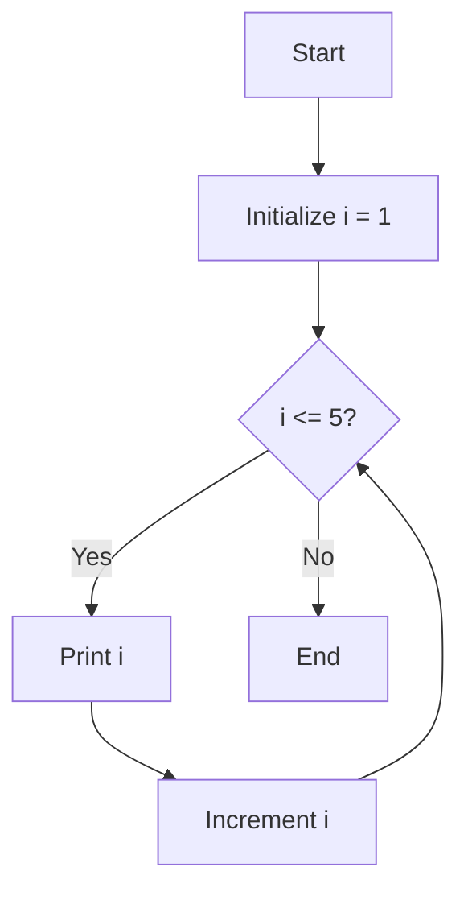
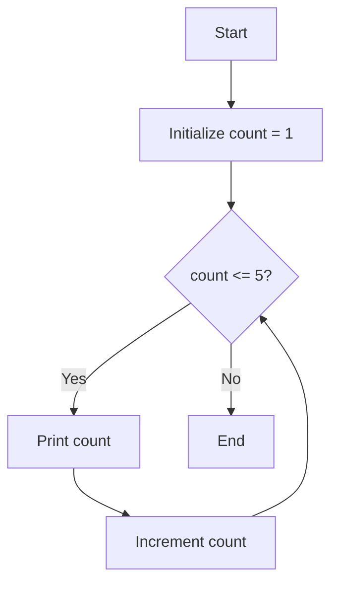
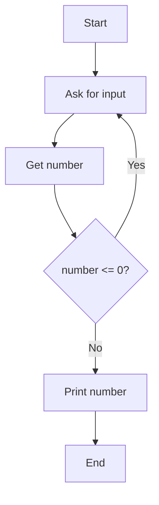

# Loops

Loop: A control structure that repeats a block of code multiple times.

## For Loop

```cpp
#include <iostream>

int main() {
    // Count from 1 to 5
    for (int i = 1; i <= 5; i++) {
        std::cout << "Count: " << i << std::endl;
    }
    
    return 0;
}
```


**For Loop Diagram:**



**Output:**

```bash
Count: 1
Count: 2
Count: 3
Count: 4
Count: 5
```

## While Loop

```cpp
#include <iostream>

int main() {
    int count = 1;
    
    // Count from 1 to 5
    while (count <= 5) {
        std::cout << "Count: " << count << std::endl;
        count++;
    }
    
    return 0;
}
```

**While Loop Diagram:**



**Output:**

```bash
Count: 1
Count: 2
Count: 3
Count: 4
Count: 5
```

## Do-While Loop

```cpp
#include <iostream>

int main() {
    int number;
    
    do {
        std::cout << "Enter a positive number: ";
        std::cin >> number;
    } while (number <= 0);
    
    std::cout << "You entered: " << number << std::endl;
    
    return 0;
}

```


**Do-While Loop Diagram:**




**Example Interaction:**

```bash
Enter a positive number: -5
Enter a positive number: 0
Enter a positive number: 10
You entered: 10
```

##  Arrays

Array: A collection of elements of the same type stored in contiguous memory locations.

```cpp
#include <iostream>

int main() {
    // Declare and initialize an array
    int numbers[5] = {10, 20, 30, 40, 50};
    
    // Access array elements
    std::cout << "First element: " << numbers[0] << std::endl;
    std::cout << "Third element: " << numbers[2] << std::endl;
    
    // Modify an element
    numbers[1] = 25;
    std::cout << "Modified second element: " << numbers[1] << std::endl;
    
    // Loop through array
    std::cout << "All elements: ";
    for (int i = 0; i < 5; i++) {
        std::cout << numbers[i] << " ";
    }
    std::cout << std::endl;
    
    return 0;
}
```

**Diagram**

```cpp
┌───────────────────────────────────────────────────────────┐
│                     Array in Memory                       │
│                                                           │
│  ┌─────┬─────┬─────┬─────┬─────┐                          │
│  │  10 │  25 │  30 │  40 │  50 │                          │
│  └─────┴─────┴─────┴─────┴─────┘                          │
│    [0]   [1]   [2]   [3]   [4]    ← Index positions       │
│                                                           │
│  numbers[0] = 10                                          │
│  numbers[1] = 25  (modified from 20)                      │
│  numbers[2] = 30                                          │
│  numbers[3] = 40                                          │
│  numbers[4] = 50                                          │
└───────────────────────────────────────────────────────────┘

```

**Output**
```
First element: 10
Third element: 30
Modified second element: 25
All elements: 10 25 30 40 50
```
