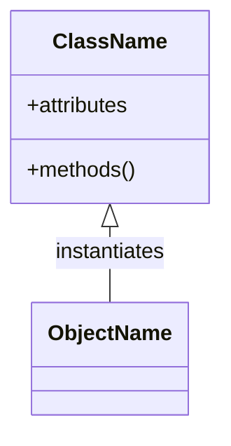
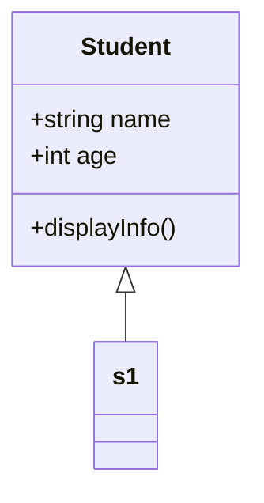
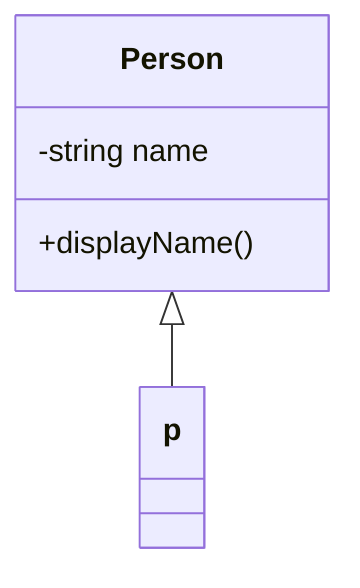
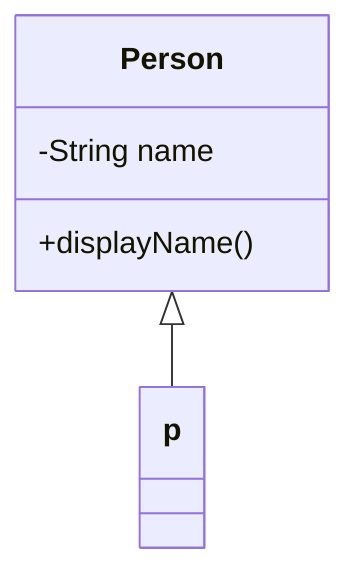
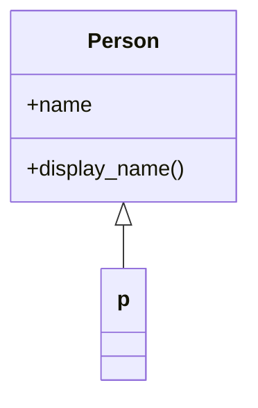
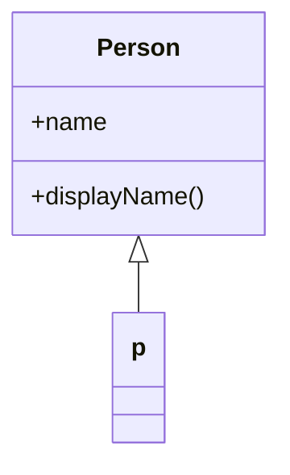
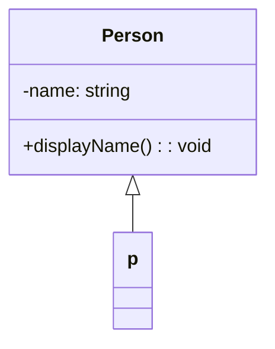

# Classes and Objects

<!--markdownlint-disable MD036 MD024 MD025 MD001 MD026 MD004 MD051 MD056 MD020 -->

### Definition :

A **class** is a user-defined blueprint or prototype from which objects are created. It defines
properties (attributes/fields) and behaviors (methods). An **object** is a specific instance of a
class that holds actual values and can call the methods defined in the class.

---

### Concept Diagram (Common to All Languages)



---

## **C++**

### Syntax

```cpp
class ClassName {
  // Access specifier (public, private, protected)
public:
    // Data members
    int data;

    // Member function
    void display();
};

// Defining member function outside the class
void ClassName::display() {
    // Code to display something
}
```

### Example

```cpp
#include <iostream>
using namespace std;

class Student {
public:
    string name;
    int age;

    void displayInfo() {
        cout << "Name: " << name << endl;
        cout << "Age: " << age << endl;
    }
};

int main() {
    Student s1;
    s1.name = "Alice";
    s1.age = 20;
    s1.displayInfo();

    return 0;
}
```

### Diagram



---

## **C#**

### Syntax

```csharp
class className {
    string name;

    public className(string value) {
        name = value;
    }

    public void methodName() {
        Console.WriteLine(name);
    }
}

className obj = new className("value");
obj.methodName();
```

### Example

```csharp
using System;

class Person {
    private string name;

    public Person(string personName) {
        name = personName;
    }

    public void displayName() {
        Console.WriteLine("Name: " + name);
    }
}

class Program {
    static void Main() {
        Person p = new Person("Alice");
        p.displayName();
    }
}
```

### Diagram



---

## **Java**

### Syntax

```java
class className {
    String name;

    className(String value) {
        name = value;
    }

    void methodName() {
        System.out.println(name);
    }
}

className obj = new className("value");
obj.methodName();
```

### Example

```java
public class Person {
    private String name;

    public Person(String personName) {
        name = personName;
    }

    public void displayName() {
        System.out.println("Name: " + name);
    }

    public static void main(String[] args) {
        Person p = new Person("Alice");
        p.displayName();
    }
}
```

### Diagram



---

## **Python**

### Syntax

```python
class className:
    def __init__(self, value):
        self.name = value

    def methodName(self):
        print(self.name)

obj = className("value")
obj.methodName()
```

### Example

```python
class Person:
    def __init__(self, name):
        self.name = name

    def display_name(self):
        print(f"Name: {self.name}")

p = Person("Alice")
p.display_name()
```

### Diagram



---

## **JavaScript**

### Syntax

```javascript
class className {
    constructor(value) {
        this.name = value;
    }

    methodName() {
        console.log(this.name);
    }
}

const obj = new className("value");
obj.methodName();
```

### Example

```javascript
class Person {
    constructor(name) {
        this.name = name;
    }

    displayName() {
        console.log("Name: " + this.name);
    }
}

const p = new Person("Alice");
p.displayName();
```

### Diagram



---

## **TypeScript**

### Syntax

```typescript
class className {
    name: string;

    constructor(value: string) {
        this.name = value;
    }

    methodName(): void {
        console.log(this.name);
    }
}

const obj = new className("value");
obj.methodName();
```

### Example

```typescript
class Person {
    private name: string;

    constructor(personName: string) {
        this.name = personName;
    }

    public displayName(): void {
        console.log("Name: " + this.name);
    }
}

const p = new Person("Alice");
p.displayName();
```

### Diagram



---

[Back to top](#classes-and-objects)

---
