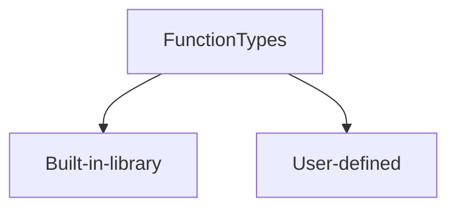
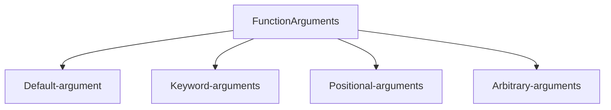

# Functions
<!--markdownlint-disable MD013 MD029 MD036 MD024 MD033 MD040 MD042 MD001 MD051 MD025-->
A function is a block of code that performs a specific task.

Dividing a complex problem into smaller functions makes our program easy to understand the program.

## Types of functions



1. Built-in library function:
These are Standard functions that are available to use.

2. User-defined function:
Our own functions based on our requirements.

## C++ Function

```c
access returnType functionName(dataType param, dataType param2,...) {
 // function body
}

// Example:
public int add(int i, int j, int k){
    return i+j+k; 
}
```

***NOTE:***
C# and Java functions are similar to C++

## Javascript Function

```js
function functionName (param, param2,...) { 
  // function body 
}

// Example:
function add(i, j, k){
  return i+j+k;
}
```

## Python Functions

Python function is defined using the def keyword:

```python
def function_name(arguments):
    # function body 
    return

#Example:
def add_numbers(i, j, k):
    sum = i + j + k
    return sum

```

### Types of Python Function Arguments



***1. Default Arguments:***

A default argument is a parameter that assumes a default value if a value is not provided in the function call for that argument.

```python
# Python program to demonstrate
# default arguments
def myFun(x, y=50):
 print("x: ", x)
 print("y: ", y)


# Driver code (We call myFun() with only
# argument)
myFun(10)

""""
Output
x:  10
y:  50
""""
````

***2. Keyword Arguments:***

Parameter Names are used to pass the argument during the function call.
So that the caller does not need to remember the order of parameters.

```python
# Python program to demonstrate Keyword Arguments
def Employee(firstname, lastname):
 print(firstname, lastname)


# Keyword arguments
Employee(firstname='Ram', lastname='Das')
Employee(lastname='Das', firstname='Ram')

""""
Output
Ram Das
Ram Das
````

***3.  Positional-arguments:***

Arguments are passed in the order of parameters. The order defined in the order function declaration.

Order of values cannot be changed to avoid the unexpected output.

```python
def Person(name, age):
 print("Hi, I am", name)
 print("My age is ", age)


# You will get correct output because
# argument is given in order
print("Case-1:")
Person("Ram", 47)
# You will get incorrect output because
# argument is not in order
print("\nCase-2:")
Person(47, "Ram")

"""
Output
Case-1:
Hi, I am Ram
My age is  47

Case-2:
Hi, I am 47
My age is  Ram

"""
````

***3. Arbitrary argument***

In Python Arbitrary Keyword Arguments, *args, and **kwargs can pass a variable number of arguments to a function using special symbols.

There are two special symbols:

- *args in Python (Non-Keyword Arguments)

- **kwargs in Python (Keyword Arguments)

Example 1: Variable length non-keywords argument

```python
# Python program to illustrate
# *args for variable number of arguments
def myFunc(*args):
 for arg in args:
  print(arg)


myFunc('Hello', 'Welcome', 'to', 'NBT')

"""
Output

Hello
Welcome
to
NBT
"""
````

Example 2: Variable length keyword arguments

```python
# Python program to illustrate
# *kwargs for variable number of keyword arguments


def myFunc(**kwargs):
 for key, value in kwargs.items():
  print("%s == %s" % (key, value))


# Driver code
myFunc(firstName='T', midName='Nag', lastName='VB')

"""
Output

firstName == T
midName == Nag
lastName == VB
"""
````

## Python Function within Functions

A function that is defined inside another function is known as the inner function or nested function. Nested functions are able to access variables of the enclosing scope. Inner functions are used so that they can be protected from everything happening outside the function.

```python
# Python program to
# demonstrate accessing of
# variables of nested functions

def f1():
 s = 'I love Nagvbt'
 
 def f2():
  print(s)
  
 f2()

# Driver's code
f1()

"""
Output:

I love Nagvbt
"""
````

## Anonymous functions in Python
