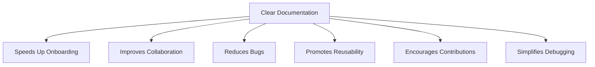
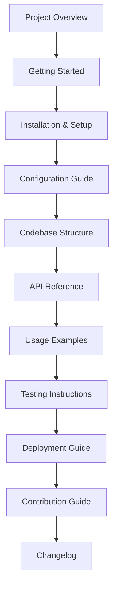
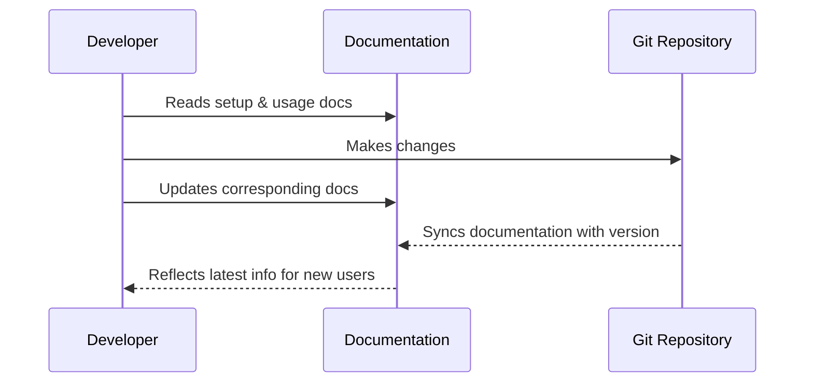
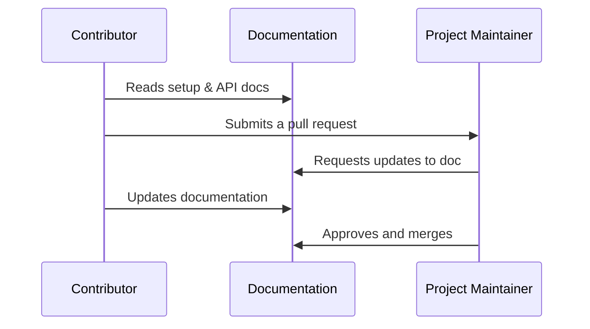
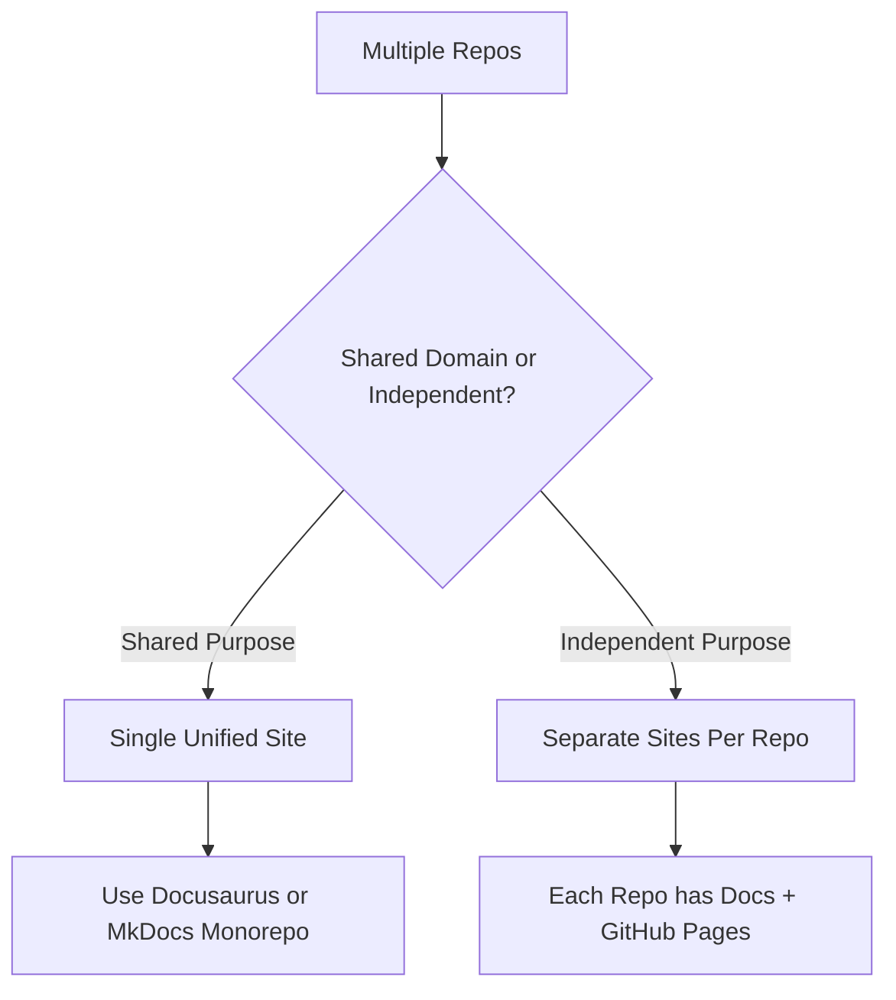
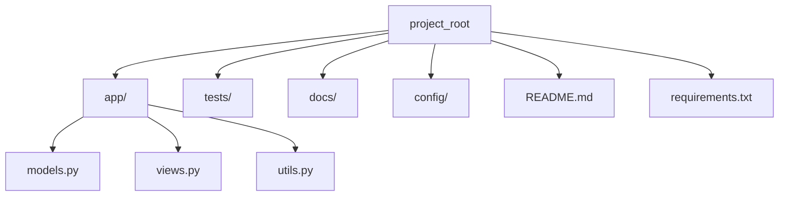

# 📘 Architecting Documentation for Development Teams

Good documentation bridges the gap between code and its users. Whether you are working solo or in a
team, comprehensive developer documentation makes your project scalable, maintainable, and user-friendly.

---

## 🧠 What Is Developer Documentation?

Developer documentation is the written guide that explains how a software project works, how to use
it, and how to contribute to it. It includes setup instructions, architectural overviews, code
explanations, and API references.

---

## 🌟 Why Documentation Is Essential

Documentation helps in multiple areas throughout the development lifecycle.

## Highlights

- **Smoother onboarding:** New developers can ramp up without hand-holding.

- **Reduced support load:** Fewer questions from users and teammates.

- **Faster debugging:** Helps trace issues when systems are well documented.

- **Better collaboration:** Shared language and expectations across contributors.

- **Knowledge retention:** Institutional knowledge doesn’t leave with people.

- Team members stay aligned.
- Fewer misunderstandings lead to fewer bugs.
- Reusable modules emerge as documentation reveals structure.

---

## 📂 What Should Be Documented?

A complete documentation system consists of several structured sections. Each one serves a unique
role in guiding the developer journey.

### 🧾 Breakdown of Sections

#### 1. **Project Overview**

- Purpose of the project
- Who should use it
- Key features and architecture

#### 2. **Getting Started**

- Quick-start commands
- Environment requirements (Python version, DBs, etc.)

#### 3. **Installation & Setup**

- Local setup guide
- Docker/Kubernetes setup if applicable

#### 4. **Configuration Guide**

- Explanation of `config.json`, `.env`, or YAML files
- Defaults and customization options

#### 5. **Codebase Structure**

- Explanation of folders, key files, and logic layout
- Directory map and ownership

#### 6. **API Reference**

- REST/GraphQL endpoints
- Request/response formats
- Authentication and headers

#### 7. **Usage Examples**

- Command-line or code samples
- Real-world scenarios

#### 8. **Testing Instructions**

- How to run unit, integration, or system tests
- Test file naming conventions and coverage tools

#### 9. **Deployment Guide**

- CI/CD instructions
- Environments (dev, staging, production)

#### 10. **Contribution Guide**

- Forking, branching, commit rules
- PR templates and review processes

#### 11. **Changelog**

- Versioning history
- Semantic versioning format

---

## 🛠 How to Document Effectively

Here are a few key practices for writing useful documentation:

1. Keep it Version-Controlled
Use the same Git repository as the code to track changes in sync.

2. Use Markdown and Static Site Generators
Tools like Docusaurus, MkDocs, or Sphinx convert Markdown into readable sites.

3. Include Diagrams
Visuals like Mermaid diagrams can make complex workflows easier to understand.

## 🔄 Developer-Documentation Workflow

---

## ✅ Best Practices

- Keep documentation close to code.

- Review and update docs with every feature change.

- Make docs interactive with code samples and CLI commands.

- Encourage contributors to document as they go.

## 🔄 Documentation Lifecycle

## 🌐 One Website or Multiple for Documentation?

Choosing a documentation hosting strategy depends on the number of repositories and how tightly
they’re connected.

### ✅ When to Use a Single Site

- Repositories share core logic or modules.
- You're building a developer platform.
- Internal teams want one portal for everything.

### ✅ When to Use Separate Sites

- Repositories serve unrelated audiences.
- Smaller, lightweight tools/projects.
- Open-source modules maintained independently.

---

## ⚙️ Tools for Documentation

Here are some tools that help create and maintain developer documentation efficiently:

| Tool          | Use Case                          | Highlights                    |
|---------------|-----------------------------------|-------------------------------|
| Docusaurus    | React-based doc site              | Versioning, search, theming   |
| MkDocs        | Python-friendly, markdown-based   | Simple, fast, GitHub-ready    |
| Sphinx        | Python code documentation         | Auto-doc generation           |
| Swagger/OpenAPI | API documentation               | Interactive UI, live testing  |
| Mermaid       | Diagrams in markdown              | Flowcharts, sequence diagrams |

---

## 🧑‍🏫 Real-Life Example: Folder Structure Doc

Let’s say you’re documenting a Python project. You might include a diagram like this:

And then describe:

- `app/` contains core logic
- `tests/` includes unit/integration tests
- `docs/` holds markdown files and diagrams
- `config/` includes env configs and secrets templates

---

## 🔧 Maintenance Tips for Living Docs

- ✅ Update docs with every feature/bug fix
- ✅ Use GitHub Actions to build and deploy docs
- ✅ Require doc updates as part of PR reviews
- ✅ Store all docs in a `docs/` or `site/` folder
- ✅ Add a link to documentation in your repo README

---

## 📌 Conclusion

Developer documentation is not an afterthought — it's a *development asset*. It reduces onboarding
time, enables scalability, and helps your code outlive your presence.

> 💬 “Code tells you how, but documentation tells you *why*.”

Well-documented projects are easier to maintain, grow faster, and attract better contributors.

---

## 🔍 Want to Start Your Own Documentation Site?

Here are your first steps:

1. Use `MkDocs` for Markdown-based docs (great for Python projects)
2. Use `Docusaurus` if you prefer React and want dynamic navigation
3. Start with `README.md` and grow into `docs/` folder
4. Deploy to GitHub Pages or Netlify

---

## 💡 Final Thoughts

Developer documentation isn't just a side task — it's a pillar of good software engineering. Whether
you're an individual contributor or part of a large team, investing time in writing and maintaining
helpful docs will pay off by reducing bugs, support requests, and wasted effort.

Good documentation tells the story of your code. Don’t let it remain untold.

### 🏁 Happy documenting! 💡
