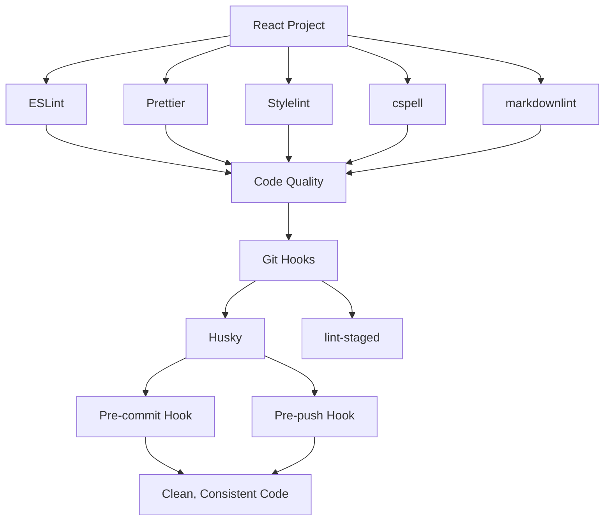
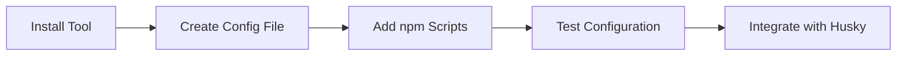
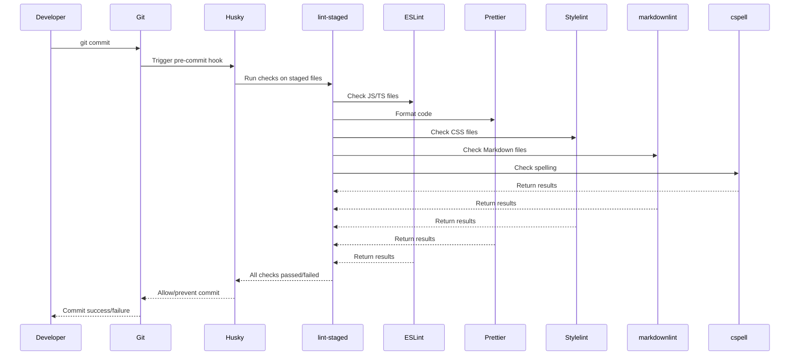
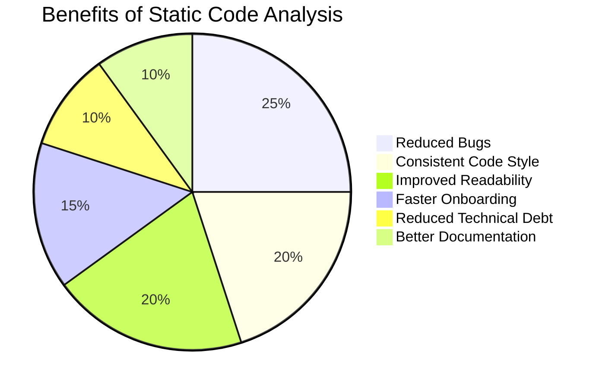
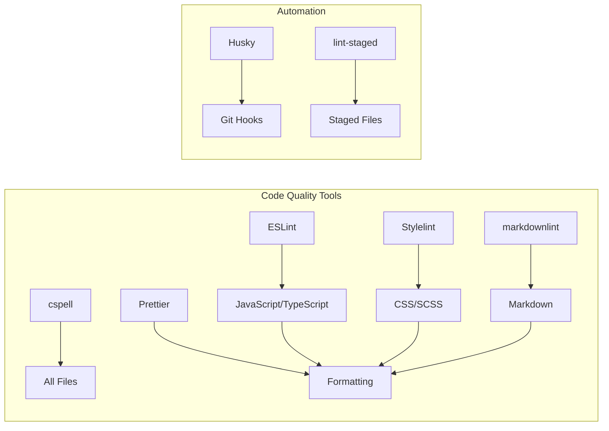

# 🚀 Mastering Code Quality: A Complete Guide to Static Analysis Tools

Ensuring code quality is no longer optional—it's a critical part of building reliable, scalable, and
maintainable software. High-quality code not only reduces bugs and improves performance, but also
fosters better collaboration and easier onboarding for new developers.

This comprehensive guide walks you through setting up a static code analysis pipeline using
industry-standard tools. We'll use a React project as our reference implementation, but the
principles and tools discussed here can be applied to any Node.js-based project.

You'll learn how to integrate and configure essential tools such as:

- ESLint for JavaScript/TypeScript linting

- Prettier for consistent code formatting

- Stylelint for CSS/SCSS style validation

- markdownlint for markdown files

- cspell for detecting spelling issues in code and documentation

- Husky and lint-staged for enforcing quality checks before commits

Whether you're starting a new project or improving an existing one, this guide will help you
establish a solid foundation for automated static analysis, keeping your codebase clean, readable,
and error-free.

Let's dive in and build a better code quality pipeline—step by step.

<!--truncate-->

## 💡 Why Static Code Analysis Matters

Static code analysis helps catch issues before they make it into production. By automating checks
for code style, potential bugs, and even spelling errors, you can:

- ✅ Maintain consistent code style across your team
- 🐛 Catch bugs early in the development process
- 🧹 Reduce technical debt
- 📖 Improve code readability and maintainability
- 🏆 Enforce best practices

## 🔧 The Static Analysis Toolchain

Let's visualize the complete toolchain we'll be setting up:



## 🏗️ Setting Up Your React Project

Let's start by creating a new React application:

```bash
npx create-react-app my-app --use-npm
```

```bash
cd my-app
```

```bash
git init
```

## 📦 Installing Dependencies

We'll need several development dependencies to set up our static analysis pipeline:

```bash
yarn add -D eslint prettier stylelint husky lint-staged stylelint-config-standard cspell 
stylelint-config-standard markdownlint markdownlint-cli
```

## 🔄 Tool Configuration Workflow

The configuration process follows this pattern:



## 🛡️ Configuring ESLint

ESLint helps identify and report on patterns in JavaScript/TypeScript code:

```bash
npx eslint --init
```

Create `.eslintrc.json`:

```json:.eslintrc.json
{
  "extends": ["react-app", "eslint:recommended", "plugin:prettier/recommended"],
  "rules": {
    "prettier/prettier": "error"
  }
}
```

Create `.eslintignore`:

```text:.eslintignore
# Third party
**/node_modules

# Build products
build/
static/
docs/
```

Add scripts to `package.json`:

```json:package.json
"scripts": {
    "lint:ts": "eslint \"./src/**/*.{ts,tsx}\" --max-warnings 0",
    "lint:ts:fix": "eslint --fix \"./src/**/*.{ts,tsx}\" --max-warnings 0"
}
```

## ✨ Configuring Prettier

Prettier ensures consistent code formatting:

Create `.prettierrc`:

```json:.prettierrc
{
  "arrowParens": "always",
  "bracketSpacing": true,
  "printWidth": 100,
  "semi": true,
  "singleQuote": true,
  "tabWidth": 2,
  "trailingComma": "none"
}
```

Create `.prettierignore`:

```text:.prettierignore
.git
.github
.yarn
.husky
build
node_modules
static
```

Add scripts to `package.json`:

```json:package.json
"scripts": {
    "format": "prettier --write .",
    "format:diff": "prettier --list-different ."
}
```

## 🎨 Configuring Stylelint

Stylelint helps maintain consistent CSS/SCSS:

Create `.stylelintrc`:

```json:.stylelintrc
{
    "extends": "stylelint-config-standard",
  "rules": {
    "selector-class-pattern": null,
    "value-keyword-case": ["lower", { "camelCaseSvgKeywords": true }]
  }
}
```

Add scripts to `package.json`:

```json:package.json
"scripts": {
   "lint:style": "stylelint \"**/*.css\"",
   "lint:style:fix": "yarn lint:style --fix"
}
```

## 📝 Configuring markdownlint

markdownlint ensures consistent Markdown formatting and structure:

Create `.markdownlint.json`:

```json:.markdownlint.json
{
  "default": true,
  "MD013": { "line_length": 100 },
  "MD033": false,
  "MD041": false,
  "no-hard-tabs": true,
  "whitespace": true
}
```

Add scripts to `package.json`:

```json:package.json
"scripts": {
  "lint:md": "markdownlint \"**/*.md\" --ignore node_modules",
  "lint:md:fix": "markdownlint \"**/*.md\" --ignore node_modules --fix"
}
```

## 📚 Configuring cspell (Spell Checking)

cspell helps catch spelling errors in your code and documentation:

```bash
npx cspell --init
```

Modify `.cspell.json`:

```json:.cspell.json
{
  "version": "0.2",
  "language": "en",
  "ignorePaths": ["node_modules", "build", "static", ".docusaurus", "i18n"],
  "dictionaryDefinitions": [
    {
      "name": "project-words",
      "path": "./project-words.txt",
      "noSuggest": true
    }
  ],
  "dictionaries": [
    "css",
    "html",
    "fonts",
    "typescript",
    "softwareTerms",
    "companies",
    "lorem-ipsum",
    "project-words"
  ]
}
```

Create a `project-words.txt` file for custom terminology.

Add scripts to `package.json`:

```json:package.json
"scripts": {
 "lint:spelling": "cspell \"docs/**/*.md\" \"blog/**/*.md\" \"src/**/*.js\" \"src/**/*.tsx\" 
 \"docusaurus.config.js\" --no-progress --show-context --show-suggestions",
  "lint:spelling:fix": "yarn rimraf project-words.txt && echo \"# Project Words - DO NOT TOUCH - 
  This is updated through CI\" >> project-words.txt && yarn -s lint:spelling --words-only --unique 
  --no-exit-code --no-summary \"**\" | cross-env LC_ALL=en_US.UTF-8 sort --ignore-case >> project-words.txt"
}
```

## 🔄 Automating with Git Hooks

Git hooks help enforce quality standards before code is committed or pushed:



### 🐶 Setting up Husky

```bash
npx husky init
```

Add pre-commit hook:

```bash
echo "yarn run lint-staged" > .husky/pre-commit
```

Add pre-push hook:

```bash
echo "yarn run lint-staged" > .husky/pre-push
```

### ⚡ Configuring lint-staged

Add to `package.json`:

```json:package.json
"lint-staged": {
    "src/**/*.{js,jsx,ts,tsx}": [
      "eslint --fix --max-warnings=0",
      "prettier --write",
      "cspell --no-progress --show-context --show-suggestions"
    ],
    "src/**/*.{css,scss}": [
      "stylelint --fix",
      "prettier --write"
    ],
    "{docs,blog}/**/*.{md,mdx}": [
      "markdownlint --fix",
      "prettier --write",
      "cspell --no-progress --show-context --show-suggestions"
    ]
  }
```

## 🧪 Testing Your Setup

Run these commands to verify your setup:

```bash
yarn lint:ts
```

```bash
yarn format
```

```bash
yarn lint:style
```

```bash
yarn lint:md
```

```bash
yarn lint:spelling
```

## 🔍 Comprehensive Quality Check Script

Add a comprehensive check script to `package.json`:

```json:package.json
"scripts": {
  "quality-check": "yarn lint:ts && yarn lint:style && yarn lint:md && yarn lint:spelling && yarn format:diff"
}
```

## 🧩 VSCode Extensions for Your Toolchain

To make your development experience even better, install these VSCode extensions that integrate with
your static analysis tools:

### ESLint

**ESLint** by Dirk Baeumer  
[https://marketplace.visualstudio.com/items?itemName=dbaeumer.vscode-eslint](https://marketplace.visualstudio.com/items?itemName=dbaeumer.vscode-eslint)

Integrates ESLint into VS Code to highlight linting errors in your JavaScript/TypeScript code.

```bash
code --install-extension dbaeumer.vscode-eslint
```

### Prettier

**Prettier - Code formatter** by Prettier  
[https://marketplace.visualstudio.com/items?itemName=esbenp.prettier-vscode](https://marketplace.visualstudio.com/items?itemName=esbenp.prettier-vscode)

Formats your code using Prettier on save or with a command.

```bash
code --install-extension esbenp.prettier-vscode
```

### Stylelint

**Stylelint** by Stylelint  
[https://marketplace.visualstudio.com/items?itemName=stylelint.vscode-stylelint](https://marketplace.visualstudio.com/items?itemName=stylelint.vscode-stylelint)

Highlights CSS/SCSS linting errors in your stylesheets.

```bash
code --install-extension stylelint.vscode-stylelint
```

### markdownlint

**markdownlint** by David Anson  
[https://marketplace.visualstudio.com/items?itemName=DavidAnson.vscode-markdownlint](https://marketplace.visualstudio.com/items?itemName=DavidAnson.vscode-markdownlint)

Provides linting for Markdown files.

```bash
code --install-extension davidanson.vscode-markdownlint
```

### Code Spell Checker

**Code Spell Checker** by Street Side Software  
[https://marketplace.visualstudio.com/items?itemName=streetsidesoftware.code-spell-checker](https://marketplace.visualstudio.com/items?itemName=streetsidesoftware.code-spell-checker)

Checks your code for spelling errors.

```bash
code --install-extension streetsidesoftware.code-spell-checker
```

### Error Lens

**Error Lens** by Alexander  
[https://marketplace.visualstudio.com/items?itemName=usernamehw.errorlens](https://marketplace.visualstudio.com/items?itemName=usernamehw.errorlens)

Improves error highlighting, making errors, warnings, and other language diagnostics stand out more prominently.

```bash
code --install-extension usernamehw.errorlens
```

### GitLens

**GitLens** by GitKraken  
[https://marketplace.visualstudio.com/items?itemName=eamodio.gitlens](https://marketplace.visualstudio.com/items?itemName=eamodio.gitlens)

Helps you visualize code authorship and navigate through Git repositories.

```bash
code --install-extension eamodio.gitlens
```

### Settings Sync

**Settings Sync** by Shan Khan  
[https://marketplace.visualstudio.com/items?itemName=Shan.code-settings-sync](https://marketplace.visualstudio.com/items?itemName=Shan.code-settings-sync)

Synchronize your VSCode settings across different machines.

```bash
code --install-extension shan.code-settings-sync
```

### Install All Extensions at Once

You can install all these extensions with a single command:

```bash
code --install-extension dbaeumer.vscode-eslint --install-extension esbenp.prettier-vscode 
--install-extension stylelint.vscode-stylelint --install-extension davidanson.vscode-markdownlint 
--install-extension streetsidesoftware.code-spell-checker --install-extension usernamehw.errorlens 
--install-extension eamodio.gitlens --install-extension shan.code-settings-sync
```

## 📊 Benefits of This Approach



## 🔄 Static Analysis Tools Comparison



## 🌟 Best Practices for Team Adoption

1. **🚀 Gradual Implementation**: Start with basic rules and gradually increase strictness
2. **📝 Documentation**: Clearly document why each tool is used and how to work with it
3. **⚙️ CI Integration**: Add these checks to your CI pipeline
4. **👨‍💻 Team Training**: Ensure everyone understands the tools and their benefits
5. **🔄 Regular Updates**: Keep your tools and configurations up to date
6. **🛠️ Customize Rules**: Adapt rules to fit your team's specific needs and preferences
7. **🤖 Automate Fixes**: Use the `--fix` option where possible to automate corrections

## ❓ Common Issues and Solutions

| Issue | Solution |
|-------|----------|
| 😵 Too many errors after initial setup | Start with a subset of rules and gradually add more |
| 💥 Conflicts between tools | Ensure tools are configured to work together (e.g., Prettier with ESLint)|
| 🔤 False positives in spell checking | Add legitimate terms to your custom dictionary |
| ⏱️ Slow pre-commit hooks | Use lint-staged to only check changed files |
| 🙅‍♂️ Team resistance | Demonstrate the benefits and provide clear documentation |

## 🏁 Conclusion

By implementing this comprehensive static code analysis setup, you'll significantly improve your
React project's code quality and maintainability. The initial investment in configuration pays
dividends through reduced bugs, consistent code style, and improved developer experience.

With the addition of markdownlint, you now have complete coverage across all file types in your project:

- ⚛️ JavaScript/TypeScript (ESLint)
- 🎨 CSS/SCSS (Stylelint)
- 📝 Markdown (markdownlint)
- 📄 All files (cspell for spelling, Prettier for formatting)

Remember that the goal isn't to create obstacles but to establish guardrails that help your team
deliver better code more efficiently. As your project evolves, don't hesitate to adjust your
configuration to better suit your team's needs.

Happy coding! 🚀
