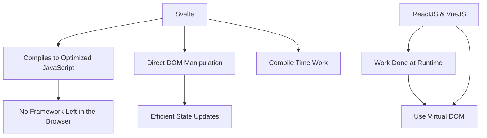

# Svelte Basics

## **Introduction to Svelte**

Svelte is a UI Framework. Unlike traditional frameworks like React or Vue, Svelte shifts much of the
work from runtime to compile time, resulting in highly optimized vanilla JavaScript that updates the
DOM directly.

It let you write breathtakingly concise components that do minimal work in the browser, using
languages you already know — HTML, CSS and JavaScript.

## Key Features of Svelte

1. **No Virtual DOM**- Svelte compiles your code to efficient vanilla JS that directly manipulates
the DOM

2. **Truly reactive** - No need for useState or reactive declarations - variables are reactive by default

3. **Less boilerplate** - Write less code to achieve the same results

4. **Built-in transitions and animations** - Smooth UI transitions with minimal code

5. **No runtime library required** - Smaller bundle sizes

## Difference between Svelte and the most popular frameworks like Vue or React

Svelte compiles your application into optimized JavaScript during the build process, rather than interpreting
it during runtime. This approach eliminates the performance overhead associated with framework abstractions
and avoids delays when the app is initially loaded.

Unlike traditional frameworks like ReactJS and VueJS, which perform most of their operations in the browser
at runtime, Svelte moves that work to the build step (compile time). Instead of using a Virtual DOM to
update the DOM through diffing, Svelte generates code that directly modifies the DOM whenever the app's
state changes.

With other frameworks, the framework itself remains part of the final output after compilation. In contrast,
Svelte compiles the code into pure, optimized JavaScript. This is why Svelte refers to itself as the
"disappearing framework" – by the time the app's code runs in the browser, the framework is essentially
gone.



## Component

In Svelte, an application is composed from one or more components.
A component is a reusable self-contained block of code that encapsulates HTML, CSS and JavaScript that
belong together, written into a .svelte file.

## Smallest program

In Svelte, an application is composed from one or more components.
A component is a reusable self-contained block of code that encapsulates HTML, CSS and JavaScript that
belong together, written into a .svelte file.

```svelte
<script>
 let message = "Hello World!"
</script>

<h1 class="message">{message.toUpperCase()}</h1>

<style>
 .message {
  color: red
 }
</style>
```

**OutPut:**

```text
HELLO WORLD!
```

## Using components

`File: Nested.svelte`

```svelte
<p>This is another paragraph.</p>
```

`File: App.svelte`

```svelte
<script>
 import Nested from './Nested.svelte'
</script>
<p>This is a paragraph.</p>

<Nested></Nested>

<style>
 p {
  color: goldenrod;
  font-family: 'Comic Sans MS', cursive;
  font-size: 2em;
 }
</style>
```

**OutPut:**

```text
This is a paragraph.

This is another paragraph.
```
