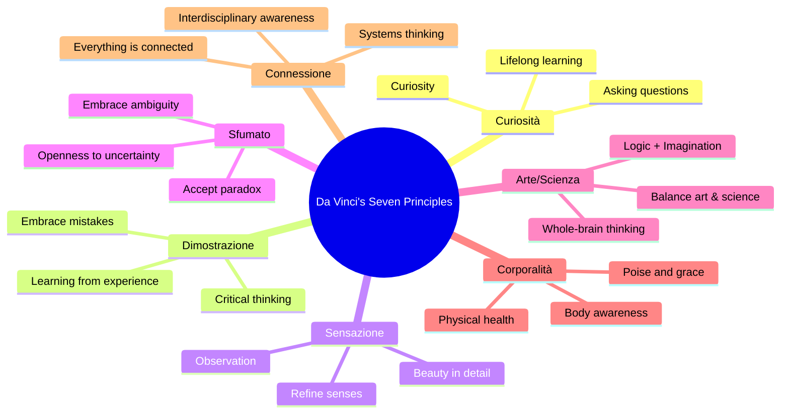
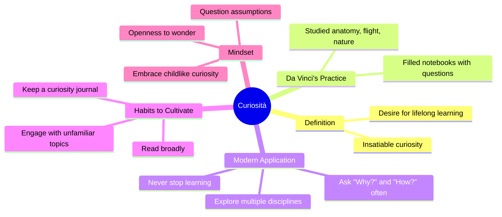
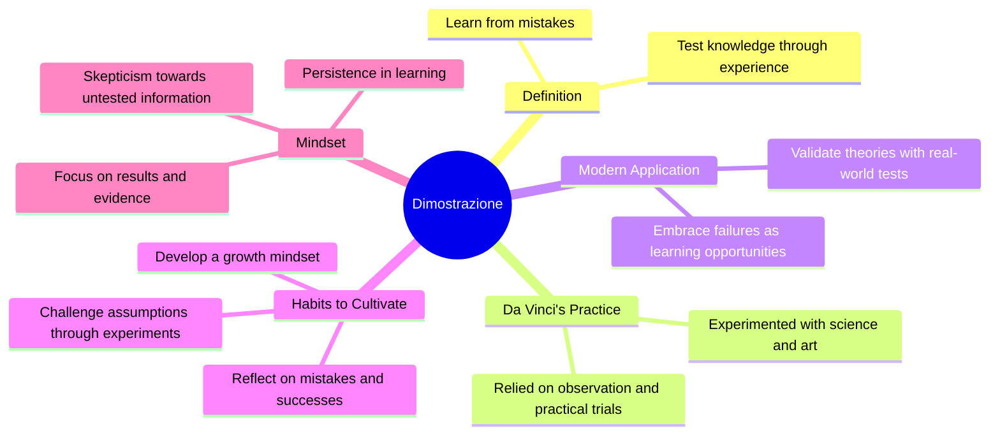
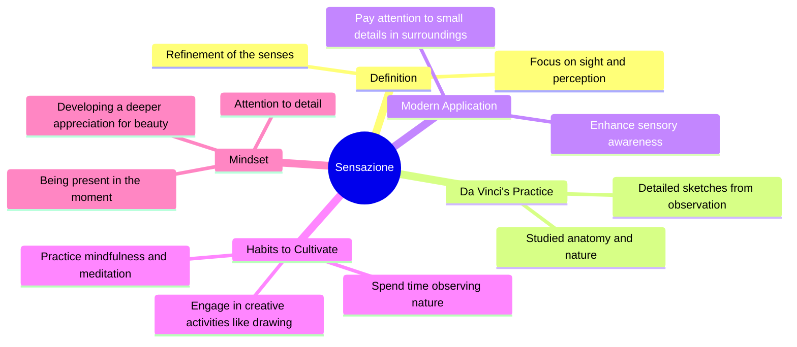
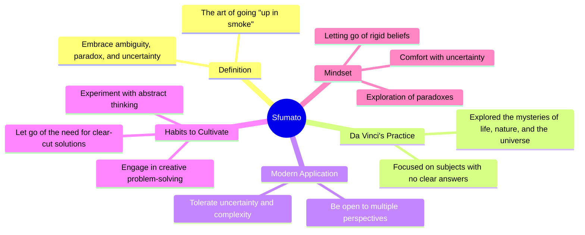
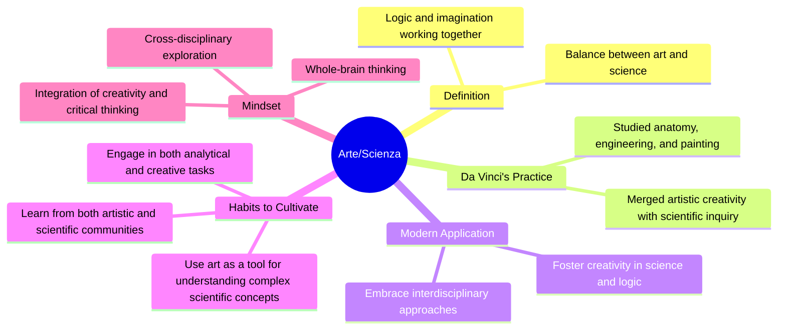
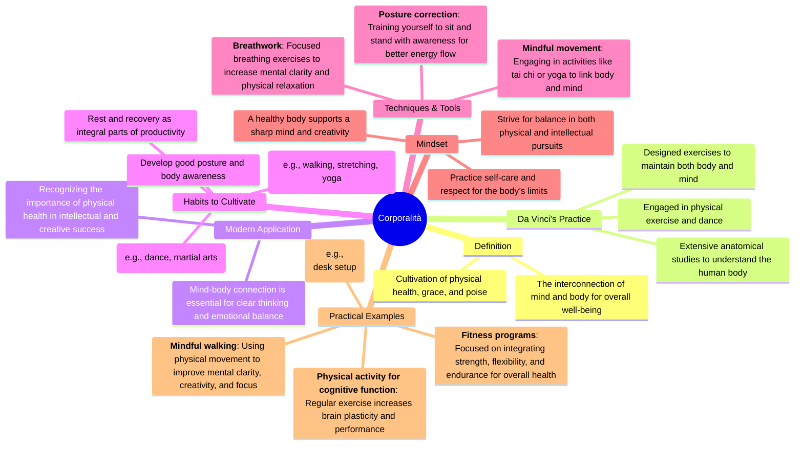
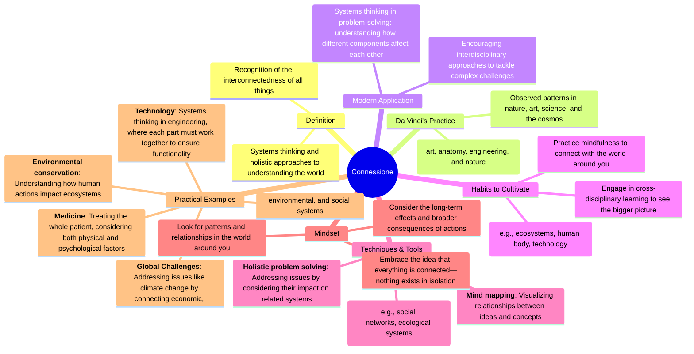

# 7 Principles of DaVinci

```mermaid
mindmap
  root((Da Vinci's Seven Principles))
    Curiosità
      Curiosity
      Lifelong learning
      Asking questions
    Dimostrazione
      Learning from experience
      Embrace mistakes
      Critical thinking
    Sensazione
      Refine senses
      Observation
      Beauty in detail
    Sfumato
      Embrace ambiguity
      Accept paradox
      Openness to uncertainty
    Arte/Scienza
      Balance art & science
      Logic + Imagination
      Whole-brain thinking
    Corporalità
      Body awareness
      Physical health
      Poise and grace
    Connessione
      Everything is connected
      Systems thinking
      Interdisciplinary awareness
```

## 1. Curiosità

```mermaid
mindmap
  root((Curiosità))
    Definition
      Insatiable curiosity
      Desire for lifelong learning
    Da Vinci's Practice
      Filled notebooks with questions
      Studied anatomy, flight, nature
    Modern Application
      Ask "Why?" and "How?" often
      Explore multiple disciplines
      Never stop learning
    Habits to Cultivate
      Keep a curiosity journal
      Read broadly
      Engage with unfamiliar topics
    Mindset
      Openness to wonder
      Embrace childlike curiosity
      Question assumptions
```

## 2. Dimostrazione

```mermaid
mindmap
  root((Dimostrazione))
    Definition
      Test knowledge through experience
      Learn from mistakes
    Da Vinci's Practice
      Experimented with science and art
      Relied on observation and practical trials
    Modern Application
      Embrace failures as learning opportunities
      Validate theories with real-world tests
    Habits to Cultivate
      Challenge assumptions through experiments
      Reflect on mistakes and successes
      Develop a growth mindset
    Mindset
      Persistence in learning
      Skepticism towards untested information
      Focus on results and evidence
```

## 3. Sensazione

```mermaid
mindmap
  root((Sensazione))
    Definition
      Refinement of the senses
      Focus on sight and perception
    Da Vinci's Practice
      Detailed sketches from observation
      Studied anatomy and nature
    Modern Application
      Enhance sensory awareness
      Pay attention to small details in surroundings
    Habits to Cultivate
      Practice mindfulness and meditation
      Spend time observing nature
      Engage in creative activities like drawing
    Mindset
      Attention to detail
      Being present in the moment
      Developing a deeper appreciation for beauty
```

## 4. Sfumato

```mermaid
mindmap
  root((Sfumato))
    Definition
      Embrace ambiguity, paradox, and uncertainty
      The art of going "up in smoke"
    Da Vinci's Practice
      Focused on subjects with no clear answers
      Explored the mysteries of life, nature, and the universe
    Modern Application
      Be open to multiple perspectives
      Tolerate uncertainty and complexity
    Habits to Cultivate
      Engage in creative problem-solving
      Let go of the need for clear-cut solutions
      Experiment with abstract thinking
    Mindset
      Comfort with uncertainty
      Exploration of paradoxes
      Letting go of rigid beliefs
```

## 5. Arte/Scienza

```mermaid
mindmap
  root((Arte/Scienza))
    Definition
      Balance between art and science
      Logic and imagination working together
    Da Vinci's Practice
      Merged artistic creativity with scientific inquiry
      Studied anatomy, engineering, and painting
    Modern Application
      Foster creativity in science and logic
      Embrace interdisciplinary approaches
    Habits to Cultivate
      Engage in both analytical and creative tasks
      Learn from both artistic and scientific communities
      Use art as a tool for understanding complex scientific concepts
    Mindset
      Whole-brain thinking
      Integration of creativity and critical thinking
      Cross-disciplinary exploration
```

## 6. Corporalità

```mermaid
mindmap
  root((Corporalità))
    Definition
      Cultivation of physical health, grace, and poise
      The interconnection of mind and body for overall well-being
    Da Vinci's Practice
      Extensive anatomical studies to understand the human body
      Engaged in physical exercise and dance
      Designed exercises to maintain both body and mind
    Modern Application
      Recognizing the importance of physical health in intellectual and creative success
      Mind-body connection is essential for clear thinking and emotional balance
    Habits to Cultivate
      Regular physical activity (e.g., walking, stretching, yoga)
      Develop good posture and body awareness
      Engage in activities that promote coordination (e.g., dance, martial arts)
      Rest and recovery as integral parts of productivity
    Techniques & Tools
      **Posture correction**: Training yourself to sit and stand with awareness for better energy flow
      **Mindful movement**: Engaging in activities like tai chi or yoga to link body and mind
      **Breathwork**: Focused breathing exercises to increase mental clarity and physical relaxation
    Mindset
      A healthy body supports a sharp mind and creativity
      Strive for balance in both physical and intellectual pursuits
      Practice self-care and respect for the body’s limits
    Practical Examples
      **Physical activity for cognitive function**: Regular exercise increases brain plasticity and performance
      **Ergonomics**: Applying body awareness for better productivity and health in daily life (e.g.,
       desk setup)
      **Mindful walking**: Using physical movement to improve mental clarity, creativity, and focus
      **Fitness programs**: Focused on integrating strength, flexibility, and endurance for overall health
```

## 7. Simultaneità

```mermaid
mindmap
  root((Connessione))
    Definition
      Recognition of the interconnectedness of all things
      Systems thinking and holistic approaches to understanding the world
    Da Vinci's Practice
      Observed patterns in nature, art, science, and the cosmos
      Saw interconnections between different disciplines (art, anatomy, engineering, and nature)
    Modern Application
      Systems thinking in problem-solving: understanding how different components affect each other
      Encouraging interdisciplinary approaches to tackle complex challenges
    Habits to Cultivate
      Cultivate curiosity about how systems work together (e.g., ecosystems, human body, technology)
      Engage in cross-disciplinary learning to see the bigger picture
      Practice mindfulness to connect with the world around you
    Techniques & Tools
      **Mind mapping**: Visualizing relationships between ideas and concepts
      **Network analysis**: Studying how components within a system are interlinked (e.g., social 
      networks, ecological systems)
      **Holistic problem solving**: Addressing issues by considering their impact on related systems
    Mindset
      Embrace the idea that everything is connected—nothing exists in isolation
      Look for patterns and relationships in the world around you
      Consider the long-term effects and broader consequences of actions
    Practical Examples
      **Environmental conservation**: Understanding how human actions impact ecosystems
      **Technology**: Systems thinking in engineering, where each part must work together to ensure functionality
      **Medicine**: Treating the whole patient, considering both physical and psychological factors
      **Global Challenges**: Addressing issues like climate change by connecting economic, 
      environmental, and social systems
```
