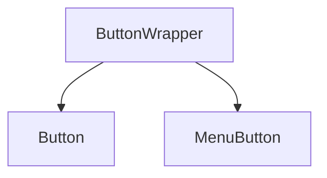

# Naming Conventions
<!--markdownlint-disable MD013 MD029 MD036 MD024 MD033 MD040-->
## Naming Convention for the Components

1. Use the `{Component name}Wrapper.JSX` for the Base Component. The Base components like ButtonWrapper will not be used directly in any of the component.
   e.g: ButtonWrapper which will not be directly used instead Button with additional behavior or styles added



2. Do NOT use `{Component name}Wrapper.JSX`

- For the components that can be used directly in to the other Components
  e.g: ListItem, Checkbox e.t.c. Here the ListItem can be used in the CollapsibleListItem, SiteMapSearchResults.

- When a Component is exported through `index.jsx`

## Folder Names

1. Top Level Folders:
   All the top level folders namely assets, components, docs, utilities and the atomic folders like atoms, molecules, organisms, templates will be in camel case

2. Component Folders:
   All the component folders need to follow the Camel Case

{' '}


## File Names

1. Component Files should follow the Pascal case

   

2. All the non component files like docs and .js files should go with Camel Case
   {' '}
   

## Storybook Component/Story naming

1. Component name in storybook should match with the actual exported component Name
   e.g. MenuList is the actual Component name but in storybook shown as MenuList*s*

```
export default {
  title: 'Components/Atoms/MenuList',
  component: MenuList
};
```

2. The story name should be 'Playground' if it capable of changing it features when user changes the properties
